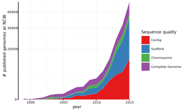

# Introduction {#intro}

```{block, type="quote"}
> "It was the best of times, it was the worst of times"
>
> --- Charles Dickens, *A Tale of Two Cities*
```

<span class="newthought">The life of microbiologists has changed dramatically</span> in the last decade, in no small part due to the advancement in sequencing technology. While other *\*omics* fields have seen great advancements in acquisition methodology, it is fair to say that genomics are leading the pack when it comes to high-throughput data acquisition (figure&nbsp;\@ref(fig:genevol)). With the next generation sequencing technology lurking just around the corner it is a good bet that the data acquisition rate will explode once again. So this is indeed the *best of times* to work with genome data.

```{r genevol, fig.cap="Number of genomes deposited in NCBIs Assembly database per year, split by assembly quality.", fig.align='center', out.width='90%', echo=FALSE}

```

All this data poses a problem though; its existence cannot be ignored but on the other hand it is not guarantied that it can be converted into relevant knowledge. Traditional wet-lab microbiologists are not necessarily equipped to undertake massive data-mining efforts to determine if relevant information is hiding in the vast sea of public or private genome sequence data. Worse still trained bioinformaticians can have a hard time keeping on top of the data influx as it accelerates faster than <span class="abr">CPU</span> speed and many available algorithms do not scale linearly. The possibility of drowning in data certainly also makes this the *worst of times*.

The field of comparative microbial genomics lies in the center of this conundrum. The increase in data makes comparative analyses much more powerful, but many tools in use are not developed with the currently available size of data in mind. This in turns diminishing the utility of the increase in available data. This dissertation aims to address some of the shortcomings of current tools, both when it comes to analysis and interpretation of comparative genomics datasets.

## The Microbial Pangenome
Within comparative microbial genomics a *pangenome* is considered a grouping of genes across genomes based on similarity. The term was first defined by @Medini:2004cc in 2004 while @Tettelin:2005jg one year later published the first pangenome of a species. While the size of some  recently published pangenomes (see table&nbsp;\@ref(tab:panstudy)) dwarfs the 8 strains of *Streptococcus agalactiae* investigated by Tettelin et al., many of the ideas and nomenclature laid out in their paper lives on. Gene groups are often classified by their prevalence among the genomes in the pangenome. *Core* gene groups are represented in all genomes, *accessory* gene groups in some, but not all genomes, and *singleton* gene groups in only a single genome (see figure&nbsp;\@ref(fig:panexpl) for an overview of structure and terminology). When working with incomplete genome sequences the core is usually redefined to hold gene groups represented in more than a certain (e.g. 0.95) ratio of genomes to make up for missing values (genes) in the dataset. Often the core gene groups are considered a representation of the minimal defining traits of the collection of genomes under investigation, specifically if the pangenome are a collection of strains from the same species the core is thought to represent the defining genes for that species. Conversely accessory gene groups will represent genes that harbors more specialized traits, e.g. niche specific genes, and singleton gene groups will represent strain specific genes as well as sequencing and annotation errors. The interpretation of the different types of gene groups is largely based on species level pangenomes and cannot directly be extrapolated to more heterogeneous pangenomes such as genus level pangenomes and above.

```{r panexpl, fig.cap="An Overview of the information captured within a pangenome. Genes are grouped based on similarity to create gene groups (rows in dot matrix) and genomes can either be represented (colored dot) or absent (grey dot) in any gene group. Common pangenome terms are labeled with those not used in this dissertation written in italic. *Shell* and *Cloud* gene groups are not always considered completely equivalent to *Accessory* and *Singleton* respectively, as the cut between *Shell* and *Cloud* can be chosen more freely, so that *Shell* gene groups are represented by most but not all genomes and *Cloud* gene groups are represented by only a few (compared to specifically a single genome for *Singleton* gene groups).", fig.align='center', out.width='90%', echo=FALSE}

```

### Use of Pangenomes
Following the inception of the pangenome concept many studies has used pangenome analysis, either partially or as a cornerstone, for investigation into the genomes of a specific taxon. As can be seen in table&nbsp;\@ref(tab:panstudy) there is a clear overweight of studies at the species level, though small pangenome studies at the genus level are also common. Contrary to what could be expected there is not a clear tendency to include more genomes in pangenome studies as time has progressed. While some clear outliers exists, the majority of studies report pangenomes containing well below 100 genomes. Some of this can be explained by pangenome studies being utilized for investigating more obscure taxa where less genomes are available. Still, sequencing costs are now so low that poor genome sequence availability can easily be remedied. This is exemplified in recent studies where pathogen outbreaks have been investigated [@Leekitcharoenphon:2016cf; @Njamkepo:2016cm], requiring large amounts of sequencing work. A few studies have ventured into pangenome studies of higher level taxa. @Lapierre:2009dt created a bacterial pangenome consisting of 573 genomes and used it to investigate gene gain and mutation events at a global scale. @Collingro:2011ke created a pangenome of the phylum *Chlamydia* based on 19 genomes and used it to investigate the evolution and characteristics of the phylum. Lastly, the *Bacilli* class was investigated using a pangenome based on 172 genomes [@Collins:2012jx] in order to evaluate modeling of core and pangenome size (see below). Pangenomes at the species level tend to show high variation between the included genomes, and it follows that the variation on genus level is even higher. Still, pangenomes at the genus level generally do not consider a higher number of genomes than those at the species level. While small genus level pangenomes can have utility in showing overarching trends, differences, and similarities for a genus, they cannot be regarded as a good representation of the genus as a whole. Thus, strong conclusions on core and pangenome sizes as well as the nature of the core should generally by avoided for these datasets.

```{r panstudy, echo=FALSE}
knitr::kable(readRDS('data/table1.rds'), caption = 'A non-exhaustive overview of publications that uses pangenome analysis as foundation or part of their investigation into a specific taxon.')
```

Pangenomes have many utilities. Often the evolutionary dynamics of a species can be investigated by modeling the presence/absence pattern of gene groups within the genomes in the pangenome. These models can be used to gain insight into the rate of mutations, recombination, and gene transfer within the species. @Tettelin:2008gc showed that Heaps law could be used to approximate the rate of gene group gain as new genomes are added to a pangenome, @Hogg:2007eu developed a model to predict the total number of available gene groups to a species as well as the number of strains necessary to sequence in order to capture them all, while @Snipen:2009cg attempted the same based on a binomial mixture model. Evidence has pointed towards most pangenomes being unbound [@Collins:2012jx], meaning that new gene groups will continue to be discovered as new strains are sequenced. To this end @Baumdicker:2011du developed the *Infinitely Many Genes model* that directly models gene loss and gene gain rates for the species under investigation. Collectively the above methods are generally concerned with modeling species level pangenomes while less attention has been given to modeling pangenomes of higher level taxa. 

Another use of pangenomes is in inferring the phylogeny between the included genomes. As opposed to phylogeny inferred from multiple sequence alignment of e.g. 16<span class="abr">S</span> ribosomal <span class="abr">RNA</span>, pangenome derived phylogeny is based on presence/absence pattern of the total gene pool. Generally pangenome based phylogeny is calculated using standard approaches to hierarchical clustering, though choice of distance measure and clustering algorithm varies. As examples of the diversity, @Richards:2014ia uses a binary distance, @Kuenne:2013dc uses Jaccard distance and @Jacobsen:2011kh the Manhatten distance. Furthermore, @Snipen:2010di propose that gene groups should be weighted differently based on their prevalence when constructing the distances. The clustering is often performed using standard agglomerative algorithms such as average [@Karlsson:2011jr] or single linkage [@Tettelin:2005jg]. 16<span class="abr">S</span> <span class="abr">RNA</span> shows little variation at the species level and below [@Vetrovsky:2012kd], meaning that pangenome based phylogeny could have better resolution at these taxon levels. Still, pangenome based phylogeny inference is likely to struggle with species having a high degree of horizontal gene transfer as the presence/absence matrix is no longer a reflection of pure linear evolution. In these cases the created phylogeny can still be of value as it can help detect genomes sharing large amount of genomic material despite lack of shared lineage.

Pangenomes can also be investigated for the sake of the gene groups rather than the genomes. Specific genes can be targeted based on their presence/absence pattern, e.g. core gene groups without any known functional annotation. The gene groups of a pangenome can also be used when building a species scaffold for *genome scale models* [@Baumler:2010ie] that makes it easy to create models for specific strains. When phenotypic information is available for the genomes in a pangenome it is possible to perform *gene trait matching* where gene groups responsible for a  specific phenotypic traits is suggested, aiding in the discovery of previously unknown gene functionality. @Bayjanov:2012iq have developed a random forest based model that performs gene trait matching, which was later used to successfully detect genes involved in sugar metabolism of *Lactobacillus paracasei* [@Smokvina:2012ec] as well as *Lactobacillus rhamnosus* [@Ceapa:2015jw]. 

Apart from the use of pangenome data in hypothesis generation it also holds value as a purely semantic tool that ensures comparable annotation between genomes in a collection. Instead of adding metadata to each single gene in all genomes, the pangenome is used as a dictionary containing all available information about the different gene groups. This ensures a central repository for gene information and makes sure that new information automatically propagate out to all affected genomes.

### Creation of Pangenomes
A pangenome analysis usually starts with a set of genomes for which coding regions have been detected. The sequences can be untranslated but most often the translated form is used in order to make sure that silent mutations do not affect sequence comparisons. In order to group genes together by similarity, a similarity measure needs to be defined. <span class="abr">BLAST</span> is used by all but a few algorithms (see table&nbsp;\@ref(tab:pantool)) but algorithms differ in how the <span class="abr">BLAST</span> results are converted into gene groups. A simple threshold based approach is the x/y rule that defines that if two genes shares more than x% similarity across a stretch of at least y% of one of the sequences then the two genes are considered similar [@DeMaayer:2014dd; @Kuenne:2013dc; @Lukjancenko:2012hx; @Jacobsen:2011kh; @Lukjancenko:2010gd; @Snipen:2010di; @Snipen:2009cg; @Hiller:2007hb; @Tettelin:2005jg; @Medini:2004cc]. The choice of values for x and y vary in the literature and often no formal justification of the chosen values are given. An alternative to the x/y rule is to use the <span class="abr">BLAST</span> quality score directly. <span class="abr">OrthoMCL</span> [@Li:2003en], <span class="abr">Sybil</span> [@Riley:2012bg] and <span class="abr">Roary</span> [@Page:2015ds] uses an E&#8209;value threshold to define similarity, while <span class="abr">PanOCT</span> [@Fouts:2012fs] and <span class="abr">LS&#8209;BSR</span> [@Sahl:2013gd] uses a normalized bit score threshold. Two general strategies are being used for converting a set of similar gene pairs into gene clusters:  either community detection or single linkage. Community detection is based on the graph defined by considering similar pairs as edges. It either employs a custom made community detection algorithm that is tailored to <span class="abr">BLAST</span> based data (e.g. <span class="abr">PanOCT</span>) or a general purpose algorithm (e.g. markov chain clustering [@vanDongen:2000us] in <span class="abr">OrthoMCL</span> and <span class="abr">Roary</span>). One downside of using community detection algorithms is that they do not ensure that the detected communities are complete subgraphs. This means that the returned gene groups might contain members with pairwise similarities that do not pass the defined threshold. Single linkage extends clusters until all genes similar to the genes in a cluster are also part of the cluster. It can be thought of as a friend-of-a-friend approach and is equivalent to detecting components in the graph used in community detection. It is generally not an advisable approach as it is easy to end up with very heterogeneous clusters where the members are only similar to a subset of the other members. 

```{r pantool, echo=FALSE}
knitr::kable(readRDS('data/table2.rds'), caption = 'A list of published tools used to create pangenomes. *Alignment* covers BLAST and BLAT, *K-mer* covers CD-Hit and USEARCH, *domain* covers use of protein domains, and *graph* covers use of encoding genomes in a de Bruijn graph structure. Citation count is taken from Google Scholar on April 24^th^, 2016 and is based on the referenced article.', align = c('l', 'r', 'c', 'c', 'c', 'c', 'r'))
```

<span class="abr">BLAST</span> is a relatively slow algorithm and comparing all sequences with each other furthermore imposes a quadratic scaling making computations of large pangenomes unfeasible or restricted to institutions with access to high performance computing hardware. A few papers have explored alternatives to <span class="abr">BLAST</span> in order to speed up computations and/or provide a linear scaling. <span class="abr">PanFunPro</span> [@Lukjancenko:2013cj] annotates every gene using <span class="abr">InterProScan</span> [@Jones:2014fn; @Zdobnov:2001jb] and groups genes that contains the same domains. <span class="abr">Micropan</span> [@Snipen:2015em] provides a similar approach in addition to standard <span class="abr">BLAST</span> procedures, using <span class="abr">HMMER3</span> [@Eddy:2011ic] on a domain database of the users choice. While the use of protein domains seems a reasonable way to simplify the data structure and speed up computations there is a risk of grouping highly annotated genes more rigorously then those with few identified domains. The extreme case are genes containing no known domains for which this approach is unfeasible and an alternative clustering approach is needed. This creates a two-tier clustering scheme where the resulting gene groups are not necessarily comparable in quality. Another way of speeding comparisons up is to use <span class="abr">K</span>&#8209;mer based alignment-free approaches, such as <span class="abr">CD&#8209;Hit</span> [@Li:2006hr; @Fu:2012jk] or <span class="abr">USEARCH</span> [@Edgar:2010cv]. These algorithms are orders of magnitude faster than <span class="abr">BLAST</span> and can cut down on computational time by either preclustering very similar sequences prior to <span class="abr">BLAST</span> comparison [@Page:2015ds] or by being used as the main clustering algorithm [@Chaudhari:2015bj]. A completely different approach is provided by <span class="abr">splitMEM</span> [@Marcus:2014ch] that aligns the full genomes instead of the protein sequences using a de Bruijn graph. The graph is build up incrementally and genomes can be added in linear time. Once the graph has been created it is trivial to locate genes and find the genomes on which they are located. While the algorithm works in linear time it has a huge memory overhead, making it difficult to apply to larger pangenomes. Recently @Baier:2016cy improved on the <span class="abr">splitMEM</span> approach to reduce the memory requirement and while it is still unable to handle thousands of genome sequences it is interesting to see whether this new approach to pangenome analysis will gain traction. While citation count is not a perfect proxy for usage statistics it is clear that <span class="abr">BLAST</span> based pangenome tools are still in heavy use, and the approach is still being incorporated into newly released tools (table&nbsp;\@ref(tab:pantool)). Still, many recent tools are exploring alternative strategies as a reaction to the need for faster and more scalable pangenome tools.

When looking solemnly on sequence similarity it is impossible to determine the correct clustering in the presence of paralogues. Most algorithms ignores this and simply includes paralogues into the same gene group leading to genomes being represented multiple times in some gene groups. Recently some algorithms have opted for a strict orthologue grouping of genes by incorporating information about the surrounding chromosomal neighborhood into the clustering. <span class="abr">IONS</span> [@Seret:2011it] was an early algorithm that reanalyzed gene groups created by other algorithms and split them up based on similarity between the members genomic neighborhood. Such a two step process is also employed directly by <span class="abr">Roary</span>. <span class="abr">PanOCT</span> on the other hand incorporates the neighborhood information directly into the similarity score. Correctly resolving paralogues is essential for e.g. gene trait matching and other models that expect a strict orthologue grouping of genes, but the algorithms to do so still receives far less attention in publications.

Another question that arises when determining grouping criteria is how to treat gene fragments arising from frameshift events. When used in the context of evolutionary studies these fragments corresponds to very slight mutational changes and disregarding their presence completely could give these changes too much weight during phylogeny inference. Conversely in studies focusing on phenotypes the inclusion of gene fragments together with functional genes would deteriorate the predictive power of the data set. As with the question of paralogue determination most algorithms ignore this and simply include fragments if they pass the defined threshold. <span class="abr">PanOCT</span> deliberately examines gene groups for fragments and if present ensures that only the longest fragment from each frameshift event is included in the group. Currently no algorithm includes the possibility of removing the fragments altogether during the clustering, but it can relatively easy be performed as a second step by examining the lengths of the genes in each group.

The multiple ways in which a pangenome can be constructed, the differences in interpretation of what constitutes a gene group as well as the different taxon levels that can be chosen requires clarity when discussing result of pangenome analyses. This dissertation will qualify the notion of pangenomes with its taxon level if relevant, e.g. *genus-level pangenome*, to make sure the nature of the discussed pangenome is apparent.

## Visualizing Genomic Information
Visualization has played a major role in the progress within genome analysis that has happened in the last two decades. This is due to their ability to facilitate the interpretation of the increasingly massive and complex data resulting from the improvement in acquisition technologies. The majority of genomic visualization tools focuses on showing information linked to chromosomal position, such as annotations and sequence statistics and many approaches to comparative genomics visualization are derivative of these efforts. Thus, in order to understand the current state of pangenome visualization it is necessary to first understand the approaches to genomic visualization in general.

### Visualizing a Genome
The predominant way of visualizing genomes is by using the chromosome as an axis and plot features of the sequence along that. Multiple features can be plotted on top of each other in separate lanes, making it possible to show a wide variety of information at once. There is no shortage of tools for creating such plots and this visualization type is often directly implemented into <span class="abr">GUI</span>-based genomics software [@Abeel:2012dr; @Carver:2012km; @Carver:2009fa; @Dhillon:2013et; @Fiume:2012di; @Kerkhoven:2004fq; @Petkau:2010fk; @Anonymous:2014vc; @Qureshi:2010td; @Thorvaldsdottir:2013iw]. Two different layouts are often used for these types of visualizations, either linear or circular. The circular layout was popularized by tools such as <span class="abr">Circos</span> [@Krzywinski:2009ix] and maps chromosomal position to radians (see e.g. @Dhillon:2013et). The benefit is that circles are space filling and allows for easy linking between different areas of the chromosome using edges or chords. Unfortunately, zooming in on circular layouts are not straightforward due to the angular difference between different points. Furthermore, as multiple lanes are added to the visualization the outer lanes will gain more prominence as their arc length will be longer than an equivalent area in an inner lane. These problems are not present with linear layouts, but these are less suited to show the complete genome at once due to their lack of compactness. These differences means that circular layouts are often used for overview visualizations whereas linear layouts are used for detail views of specific areas of the genome (as in e.g. @Petkau:2010fk).

### Showing Genome Relationships
While often being used in the context of pangenome analysis many visualizations in comparative genomics are not concerned with strict pangenome data. Often the focus is on how the full genome sequences relate to each other and the synteny between them. There are two popular approaches to synteny visualization: tile and edge based. Tile based synteny visualization uses a single reference genome to define an axis and then shows presence of matching stretches of <span class="abr">DNA</span> in other genomes as heatmap lanes [@Alikhan:2011em; @Carver:2012km; @Grant:2012gc; @Hallin:2008fl; @Lechat:2012cw; @Louis:2012iq; @Meyer:2009hg; @Riley:2012bg; @Rokicki:2014ih] (see figure \@ref(fig:collage)<span class="abr">A</span>). Edge based synteny visualization does not use a reference genome but draws each genome and shows matching genome areas as lines between the matching position on the respective genomes [@Paterson:2012fb; @Pedersen:2011fn; @Revanna:2010cn; @Sinha:2007he; @Sullivan:2011ce; @Wang:2006cc] (see figure \@ref(fig:collage)<span class="abr">C</span>). Both approaches, while still popular, were developed at a time where the prospect of analyzing hundreds of genomes in concert seemed foreign, and they lack the scalability that is needed for the sizes of pangenomes being created today. It may be possible to add hundred lanes on a tile based synteny plot, but the reliance on a single reference genome will make the plot less and less representative of the dataset as lanes are added. For edge based synteny visualization the lack of scalability is related to the fact that when comparing more than three genomes lines will begin to cross each other making the plot difficult to read. Usually pangenome visualizations resort to simplifying genome synteny into a single measure of similarity between genomes in order to achieve scalability. <span class="abr">BLAST</span> matrices and similar heatmap based visualizations shows genome similarity by mapping the derived similarity to color [@Baddam:2013fz; @Boissy:2010ey; @Hiller:2007hb; @Jacobsen:2011kh; @Lukjancenko:2013cj; @Lukjancenko:2012hx] (see figure \@ref(fig:collage)<span class="abr">F</span>), while dendrograms are used to show hierarchical clustering based on the derived similarity [@Jun:2014gh; @Richards:2014ia; @Baddam:2013fz; @Smokvina:2012ec; @Lukjancenko:2012hx; @Broadbent:2011fa; @Kaas:2011jj; @Jacobsen:2011kh; @Lukjancenko:2010gd; @denBakker:2009gi] (see figure \@ref(fig:collage)<span class="abr">B</span>); often the two plot types are combined to offer a better overview of the data.

```{r collage, fig.cap="Examples of popular approaches to visualizing genome relationships, employed in the pangenome literature. **A:** A circular tile-based comparison between an *E. coli* genome and 27 other genomes [@Alikhan:2011em]. **B:** A dendrogram created based on the presence/absence matrix of 46 *Streptococcus* genomes, using binary distance and complete linkage [@Richards:2014ia]. **C:** An edge based comparison between the X chromosome of humans and mice [@Sinha:2007he]. **D:** A line plot showing the evolution in core and pangenome size in a pangenome based on eight *Salmonella typhi* genomes [@Baddam:2013fz]. **E:** A rose plot showing the number of unique genes among 22 *Salmonella enterica* genomes [@Jacobsen:2011kh]. **F:** BLAST-matrix showing the pairwise similarity of 20 *Lactobacillus* genomes [@Lukjancenko:2012hx].", fig.align='center', out.width='90%', echo=FALSE}

```

The most predominant pangenome visualization that directly shows pangenome data is the line plot showing the evolution in pangenome and core size as genomes are added to the pangenome. This plot comes in two flavors: one that shows specific genomes being added one at a time [@Blom:2016fs; @Jun:2014gh; @Lukjancenko:2013cj; @Smokvina:2012ec; @Lukjancenko:2012hx; @Kaas:2011jj; @Jacobsen:2011kh; @Baumler:2010ie; @Boissy:2010ey; @Lukjancenko:2010gd; @Hiller:2007hb] and one that bootstraps the selection of genomes for every number of genomes [@DeMaayer:2014dd; @Baddam:2013fz; @Meric:2013kn; @ContrerasMoreira:2013ip; @Kuenne:2013dc; @Song:2012bf; @Bottacini:2010jl; @Eppinger:2010cm; @Lefebure:2010hz; @vanSchaik:2010fl; @denBakker:2009gi; @Donati:2009ka; @Scaria:2009fn; @Rasko:2008bx; @Tettelin:2008gc] (see figure \@ref(fig:collage)<span class="abr">D</span>). The former can better show the effect a single genome can have on the total pangenome, but is very sensitive to the order in which genomes are added. The latter can show the general tendency of the evolution but cannot be used to gain knowledge into any single genome. Other direct visualizations of pangenome data exists but has yet to gain wide adoption. <span class="abr">Pan&#8209;Tetris</span> [@Hennig:2015co] shows the complete presence/absence matrix within an interactive user interface, denoting the strand location for each gene and allowing gene groups to be combined visually. Rose plots, a special case of Euler diagrams, are sometimes used to show the number of singletons within each genome in relation to the size of the combined accessory and core size [@GomezValero:2014id; @GomezValero:2013dr; @Jacobsen:2011kh] (see figure \@ref(fig:collage)<span class="abr">C</span>). Related to this type of visualization are Venn diagrams that are sometimes used to show the shared gene groups between genomes [@Blom:2008dj; @Collingro:2011ke; @Das:2015ky; @Fouts:2016ko; @Gan:2012ij; @Goh:2013jr; @Lefebure:2007gl; @Siewert:2014kg], but as Venn diagrams does not support more than five sets at a time this approach is very limited in scalability. <span class="abr">GenoSets</span> [@Cain:2012cd] uses the same notion of set theory as rose plots and Venn diagrams but shows gene groups through a parallel sets plot with axes corresponding to subsets of the pangenome. In this way it is possible to show how gene group classification changes with the subsetting, aiding in visually identifying gene groups adhering to a specific pattern. Often gene groups are considered as separate entities in pangenome visualizations, but the chromosomal location of their member genes on their respective genomes gives an inherent link between gene groups. This location link is apparent in the tile based synteny visualizations, but as discussed this approach has severe scalability limitations. There have been very few attempts to reconcile scalability with visualization of chromosomal location. <span class="abr">GenomeRing</span> [@Herbig:2012go] is one such attempt where shared chromosomal regions in the pangenome are identified and each genome is traced through their respective regions in a circular layout. This visualization has many of the benefits of tile based synteny visualization in that additional annotation can be added in relation to chromosomal position, while avoiding the need for a reference genome. Still the scalability of <span class="abr">GenomeRing</span> is very dependent on the similarity of the included genomes. A low similarity will lead to a high number of chromosomal regions and a high number of genomes will result in a large number of lines tracing each genome around the circle, both resulting in more clutter and lower readability.

There is generally a lack of novelty when it comes to the development of new visual analytics approaches to pangenomes and very few address the problem of scalability. This can in part be explained by the fact that up until now it has been very computationally expensive to generate large pangenomes. In addition, this cost has also led to less development in analytical approaches to large and heterogeneous pangenomes, again having a negative effect on the development of the visualization side of the analysis. For all the development within genomics and sequencing, pangenome analysis has remained firmly grounded, with a few exceptions, in species-level pangenomes containing well below 100 genomes. The following chapters will address some of the issues raised above, specifically the goal of this thesis is to:

- present a high quality and scalable approach to pangenome calculations that is capable of handling thousands of genomes across the bacterial domain.
- provide novel analysis and visualization approaches that can handle large and heterogeneous pangenomes, thus facilitating the interpretation of them.

## The Following Chapters
The following three chapters each centers around an article. Each chapter will include a short introduction, followed by the article itself, and concluded with a short discussion.

*Chapter \@ref(fmf)*
:   will describe the <span class="abr">FindMyFriends</span> framework for working with pangenome data and its chromosomal neighborhood-based algorithm for gene clustering.

*Chapter \@ref(pv)*
:   will describe <span class="abr">PanViz</span>, an interactive visualization of functionally annotated pangenomes.

*Chapter \@ref(hs)*
:   will describe the Hierarchical Sets analysis and its applicability to pangenome data.

Succeeding the three chapters will be a chapter tying all tools and analyses developed together, followed by a chapter with discussion on the merits of the proposed methods in relation to what is already available.
