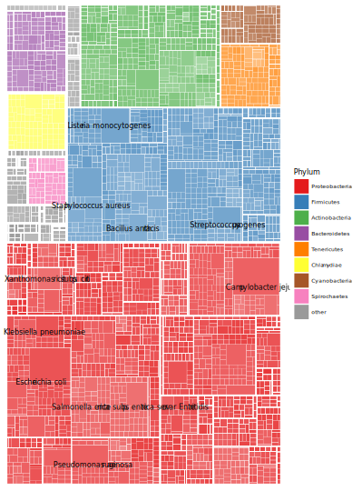
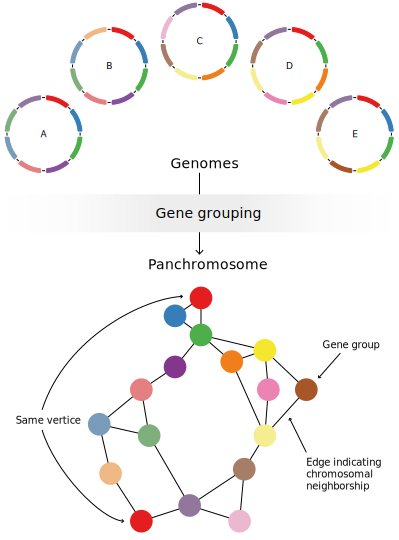
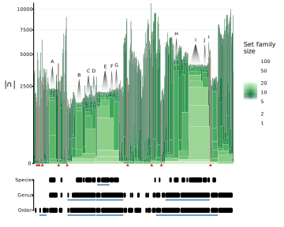
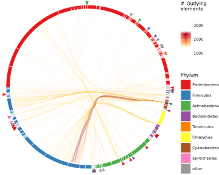
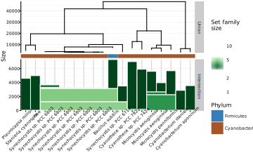
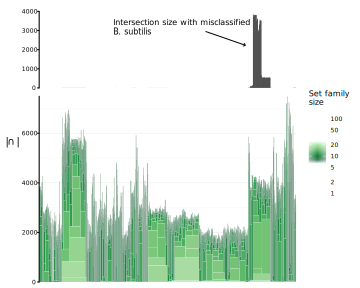
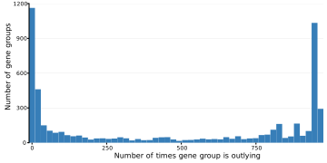

# The Sum of it All {#bp}

> "The whole is greater than the sum of its parts."
>
> --- Aristotle

<span class="newthought">The tools presented in the three preceding chapters</span> are just that; tools. In order to show a little bit more what types of novel analyses and insight can be gained from the use of these tools, this chapter will dig a little deeper into the domain-level pangenome created in chapter&nbsp;1 encompassing 4,770 genomes from the total bacterial domain. This chapter will focus on the use of <span class="abr">FindMyFriends</span> and <span class="abr">Hierarchical Set</span> analysis as <span class="abr">PanViz</span> is currently intended for medium-sized pangenomes with functional annotation. It is possible though, that some of the leads and interesting subsets revealed in this chapter could be further investigated using <span class="abr">PanViz</span>.

## An Overview of the Bacterial Pangenome
The genomes present in the generated pangenome are not a phylogenetically balanced subset of all bacteria. Rather, they reflect the interest of the scientific world as this is how genomes are chosen for sequencing. Figure \@ref(fig:treemap) shows the lack of balance by drawing a treemap of the bacterial evolutionary tree weighted by the number of genomes from each taxon represented in the pangenome. *Proteobacteria* take up about half of the pangenome, followed by *Firmicutes* and *Actinobacteria*. Thirty&#8209;one different phyla are collected in the *other* category that takes up about 8% of the genomes in the pangenome. As expected, the highest represented classifications reflect the impact of the bacteria on human society. Nine of the ten most prevalent classifications represents bacteria responsible for important human diseases. The last, *Xanthomonas citri subsp.&nbsp;citri*, is a plant pathogen responsible for citrus canker and of major economic impact [@Jalan:2013cl]. The lack of balance in the pangenome is not necessarily a problem but should be kept in mind, e.g. when evaluating the ubiquity of gene groups based on number of genomes it represents. A high number of represented genomes only equals a broadly prevalent gene if the genomes are evenly distributed throughout the phylogeny.

```{r treemap, fig.cap="An overview of the phylogeny represented by the bacterial pangenome created in chapter&nbsp;\\@ref(fmf), shown as a treemap. Each rectangle is scaled by the number of genomes in the pangenome belong to the taxon it represents. The eight largest phyla are color coded and the ten most prevalent classifications are labeled.", fig.align='center', out.width='90%', echo=FALSE}

```

To gain a broad overview of the structure of each phyla, the pangenome can be subsetted to only contain the genomes belonging to a specific phylum. Figure \@ref(fig:phylaoverview) shows the number of accessory and singleton gene groups for each phyla in raw and normalized values (there is no core present in any phyla). As expected the number of gene groups is related to the number of genomes in each phyla, though *Tenericutes* and *Chlamydiae* seems to exhibit much smaller pangenome size than what would be expected by the number of genomes representing them. It should be kept in mind that genomes in these two phyla are generally smaller with a mean size around 1000 genes, so the capacity to contain a higher number of gene groups is limited. There is a surprising agreement between the different phyla in terms of the ratio of accessory gene groups to singleton gene groups, with singletons taking up roughly 70--80% of the gene groups. *Bacteroidetes* and *Cyanobacteria* are outliers in this regard with only ~10% accessory gene groups. *Bacteroidetes* are a major part of the ecology of mammalian colons and results have indicated a high propensity for adaption through horizontal gene transfer [@Shoemaker:2001fq]. *Cyanobacteria* is one of the oldest bacterial phyla, inhabiting a large range of different habitats and showing large morphological diversity [@Schirrmeister:2010it]. Thus, the lower ratio of accessory genes for these two phyla is expected.

```{r phylaoverview, fig.cap="An overview of the distribution of gene groups within each of the labeled phyla in figure&nbsp;\\@ref(fig:treemap). Phyla are sorted by the number of genomes in the pangenome they represent. The top plot shows the raw number of gene groups while the button is normalized to the size of the pangenome.", fig.align='center', out.width='90%', echo=FALSE}
knitr::include_graphics('figures/phyla_overview.svg')
```

Switching the focus from the genomes to the gene groups, it is seen that, as expected, most gene groups only contain members from a single phylum, but a small selection (9,778) spans multiple phyla, up to maximum of three. The majority of these represents gene groups shared between *Actinobacteria* and *Proteobacteria*, but 1,730 of these are related to a single *Actinobacterium* being consistently present in otherwise *Proteobacteria*-dominated gene groups. Such a discrepancy strongly suggests a misclassification or a mis-annotated genome, underlining the caution needed when using predefined genome classifications as a guide for data analysis. In the following, the structure of the data itself rather than predefined hypotheses will, to a higher degree, be guiding the analysis.

## Looking at the Panchromosome
<span class="abr">FindMyFriends</span> allows formatting the pangenome as a graph of gene groups with edges between gene groups that lie adjacent to each other in one or more genomes. This data structure, called a *panchromosome*, is able to capture the full chromosomal position information in the pangenome in a sparse graph structure and facilitate using common graph algorithms to investigate this structure. Figure \@ref(fig:panchromexpl) shows how the genomes from figure&nbsp;\@ref(fig:panexpl) on page&nbsp;\pageref{fig:panexpl} will be converted to a panchromosomal graph.

```{r panchromexpl, fig.cap="An illustration of the panchromosome graph structure equivalent to the pangenome matrix exemplified in figure&nbsp;\\@ref(fig:panexpl). Each gene group makes up a vertex in the graph and vertexes are connected if their member genes lies adjacent to each other on one or more chromosomes. The start gene group is replicated in the network diagram to simplify the line drawing.", fig.align='center', out.width='90%', echo=FALSE}

```

The panchromosome of the bacterial pangenome contains 6,887,134 vertices (gene groups) and 7,456,591 edges. The panchromosome contains 1,281 unconnected components with the bulk of the gene groups (79%) collected in the largest component. 1,050 components, representing 6% of the gene groups, only contain singleton gene groups, meaning they only represent a single genome each. Most of the 629 genomes represented in the 1,050 singleton components were also present in some of the larger clusters, indicating that these singleton components represents either plasmids or unique chromosomes of a multi-chromosome organism. 145 genomes are only represented by one or more singleton components indicating no overlap with any other sequence in the dataset. Some of these genomes are obvious sequencing or annotation errors with very low number of genes, while 36 of them are as yet uncultivated (classified as *Candidatus*), which could explain their low similarity to the rest of the genomes. The largest component in the panchromosome spans all phyla while the others are phylum-specific. In the following, I will focus on a pangenome subset based on the 3,781 genomes represented in the larger component, not because the rest does not contain interesting information, but as a crude, albeit effective, way of filtering out the most erroneous genomes. Interestingly, this removes all but six of the 132 *Tenericutes*. This phylum is characterized by the smallest genomes of all bacteria as well as their lack of cell-wall. There has been controversy over whether the organisms classified under *Tenericutes* should constitute their own phylum or be classified under *Firmicutes* [@Wolf:2004jt]. The present pangenome strongly support the uniqueness of the *Tenericutes* at the phylum level, though it cannot rule out the possibility of strong chromosomal degradation following a split from the rest of *Firmicutes*.

The new pangenome contains 5,498,270 (80%) gene groups from 3,781 (79%) genomes and the derived panchromosome now contains 758 independent components with the largest unchanged from the prior panchromosome. While it is tempting at this point to show a network plot of the complexity of the graph, such visualizations seldom have any utility beside making impressive-looking front pages. In order to efficiently visualize the panchromosome structure it is necessary to focus on specific parts of it or formulate specific question to query it for. An example of the latter are the `variableRegions()` function in <span class="abr">FindMyFriends</span> that detects small non-linear areas of the graph that usually are the result of frameshifts, deletions/insertions, annotation errors, etc. Here, I will focus on the former though, by utilizing the <span class="abr">Hierarchical Sets</span> analysis presented in chapter&nbsp;3.

## A Very Large Set Family
Looking at 3,781 sets is quite a challenge. The number of possible combination of sets is $2^{3781} - 1$ which exceeds the highest possible number ($1.798\times10^{308}$) in most scientific software [@IEEEComputerSociety:2008gr]. <span class="abr">Hierarchical Sets</span> solves this by only looking at the most similar sets, while at the same time providing the largest groupings containing a core. A <span class="abr">Hierarchical Set</span> analysis yields 225 independent clusters (see appendix \@ref(supdata) for access to the results). As can be seen in figure&nbsp;\@ref(fig:intersection), the number of genomes and gene groups as well as the heterogeneity in the different sub-pangenomes based on the clustering vary widely. 130 of the clusters contain less than six genomes, while the largest contain 418.

```{r intersection, fig.cap="Intersection and union sizes of the set families defined by the branch points of a <span class='abr'>Hierarchical Set</span> clustering. The number of genomes represented in each intersection is color coded and the phylum of each genome is annotated between the two plots. See chapter&nbsp;\\@ref(hs) for further discussion of this plot type.", fig.align='center', out.width='90%', echo=FALSE}
knitr::include_graphics('figures/intersections.svg')
```

### The Link to Taxonomy
Each cluster is clearly dominated by a single phylum but 41 of them contains multiple phyla up to a maximum of three. The clear dominance of one phylum in the clusters that contain multiple phyla strongly suggest misclassification or annotation error for the odd phyla genomes. In total, 43 genomes are clustered within clusters dominated by a phylum different from their own and these are good candidates for a reexamination. There is no clear pattern in the phylogeny of the 43 genomes as they span 42 different species and 36 different genera so it is likely that they constitute annotation error rather than classification error of the organism they represent. The *Actinobacterium* genome that consistently was member of the same gene groups as a large subset of *Proteobacteria* genomes (see section \@ref(an-overview-of-the-bacterial-pangenome)) is naturally also present among the 43 potential.

Zooming in on the clusters dominated by *Actinobacteria* it is possible to gain a better overview of how core size relate to taxon classification. As can be seen from figure&nbsp;\@ref(fig:actintersect), the large clusters with high core sizes are generally correlated with the members coming from the same species or closely related species. Species clusters tend to have a core above 1000 gene groups, while genus clusters have a small (up to 30 gene groups), but still present, core. For order level clusters, the core has vanished completely except when the order is only represented by a single genus in which case it reflects the genus core e.g. in the case of *Propionibacteriales* and *Propionibacterium* (the cluster figure&nbsp;\@ref(fig:actintersect)<span class="abr">A</span> belongs to). These findings are in contrast with earlier top-level pangenome studies. @Lapierre:2009dt, @Collingro:2011ke, and @Collins:2012jx all found a preserved core at domain, phylum, and order level respectively. Several factors explains this difference: the current pangenome contains eight times the number of genomes of the previously reported bacterial pangenome and the clustering approach results in orthologous groups in contrast to the homologous clustering employed in previous studies. Mostly, there is a one-to-one relationship between genera and independent clusters. While figure&nbsp;\@ref(fig:actintersect) tend to support the established phylogeny, the largest rightmost cluster shed some doubts as to the classification of certain *Mycobacterium* species. *Mycobacterium tuberculosis* is split up in two groups by *Mycobacterium bovis*, *Mycobacterium canettii*, and *Mycobacterium africanum*. All of these strains are part of the *Mycobacterium tuberculosis* complex whose evolutionary history has been subject to many different interpretations, and a split of *M. tuberculosis* into two distinct groups has already been suggested [@Brosch:2002dr]. Furthermore *M. africanum* and *M. canettii* seems to be similar to *M. bovis* and *M. tuberculosis* respectively, seen from a core gene perspective at least, which also supports earlier findings [@Winglee:2016ju; @Periwal:2014dj].

```{r actintersect, fig.cap="The intersection stack reperesenting the *Actinobacteria* dominated clusters. The following strong features, representing specific species are annotated: **A:** *Propionibacterium acnes* **B:** *Bifidobacterium animalis* **C:** *Bifidobacterium longum* **D:** *Bifidobacterium breve* **E:** *Corynebacterium pseudotuberculosis* **F:** *Corynebacterium ulcerans* **G:** **Corynebacterium diphtheriae** **H:** *Mycobacterium abscessus* **I:** *Mycobacterium tuberculosis* **J:** **Mycobacterium bovis**.", fig.align='center', out.width='90%', echo=FALSE}

```

Looking at the non-*Actinobacteria*-genomes in the *Actinobacteria*-dominated clusters, it can be seen that they do not simply indicate classification errors. All genomes classified under a different phyla shows very little overlap with the genomes they are clustered together with. Still, these genomes does not constitute the most divergent genomes within the clustering as many *Actinobacteria* genomes have similar small overlaps with the rest of their cluster.

### Data Quality and Lack Thereof
In order to investigate how these "misclassified" genomes relate to genomes outside of their clusters, the outlying elements are inspected. Figure \@ref(fig:phyloout) shows the outlying elements between genomes from clusters that differ in their most dominant phylum. Many, but not all, of the strongest currents are related to "misclassified" genomes and not all "misclassified" genomes result in a high number of outlying elements. There is a clear tendency towards the "misclassified" genomes being responsible for the strongest deviations as measured by the number of outlying elements between genome pairs. The strongest deviation not involving a "misclassified" genome involves 17 outlying elements while the strongest involving a "misclassified" genome involves 3,879.

```{r phyloout, fig.cap="Hierarchical edge bundles showing the outlying elements present between genomes in clusters of different dominant phylum. The dominant phylum of each cluster is encoded in the arc color and the positions of genomes deviating from the dominant phylum are encoded as colored triangles outside the arcs.", fig.align='center', out.width='90%', echo=FALSE}

```

The strongest deviating genome, a *Firmicute* (*Bacillus subtilis*) clustered within a *Cyanobacteria*-dominated cluster, will be investigated further in the following. As can be seen in figure&nbsp;\@ref(fig:cyanintersect), this genome shows quite strong similarity with the genomes among which it is clustered, in terms of shared core. This is expected as a very high intersection size would be needed to overcome the strong link it shows to other *Firmicutes*. Still, it stands out among the other *Synechocystis sp.&nbsp;PCC 6803* it is clustered with, by containing more than twice the number of genes.

```{r cyanintersect, fig.cap="The intersection stack of one of the *Cyanobacteria* dominated clusters containing a strongly outlying *Firmicute* (*Bacillus subtilis*).", fig.align='center', out.width='90%', echo=FALSE}

```

Looking at how it relates to the other *Firmicutes* in the pangenome it can be seen that it shares a large amount of genes with genomes in one of the larger clusters (dominated by other *B. subtilis*). Again, the odd *B. subtilis* does not match in size (the other *B. subtilis* contain ~4000 genes). In fact, the size of the odd *B. subtilis* is almost exactly the sum of its intersection size with other *B. subtilis* and other *S. sp. PCC 6803*. While this could indicate a strong contamination of the sample prior to sequencing, the strain is in fact the first example of a chimera genome, constructed by cloning a full *S. sp.&nbsp;PCC 6803* genome into a *B. subtilis* [@Watanabe:2012el]. The fact that such strong genome engineering does not upset the neighborhood based clustering in <span class="abr">FindMyFriends</span> is testament to its applicability. The classification of the genome as a *B. subtilis* can be questioned though, but currently there is no formal approach to classifying chimera genomes.

```{r firmintersect, fig.cap="The intersection stack of the *Firmicutes* dominated clusters along with each genomes intersection with the deviating *Bacillus subtilis* from figure&nbsp;\\@ref(fig:cyanintersect).", fig.align='center', out.width='90%', echo=FALSE}

```

### The Curious Case of Escherichia and Shigella
It is possible to get an overview of the plasticity of the genomes within each cluster by looking broadly on the outlying elements instead of focusing on between-phyla deviations. As the number of possible outlying elements between two sets is governed by the size of the sets, it can be beneficial to look at the ratio of deviation rather than the raw number of outlying elements in order to not favor large genomes. As seen in figure&nbsp;\@ref(fig:ratioout) some clusters have a general tendency towards high internal deviation (<span class="abr">A</span> and <span class="abr">B</span> in figure&nbsp;\@ref(fig:ratioout)), while the deviations in other clusters are driven by a single or a few genomes (figure&nbsp;\@ref(fig:ratioout)<span class="abr">C</span>). A single genome is responsible for a very strong deviation across two different independent clusters. This genome, an *Escherichia coli* grouped together with the *Pasteurellales* order shares many gene groups with the other *E. coli* grouped in another cluster. Looking a bit closer reveals that the single misplaced *E. coli* only contains 134 genes. A single gene group is incidentally shared with all *Pasteurellales* while none of the 134 genes belonged to the core of the other *E. coli*, explaining the odd placement in the clustering. Looking into the submission details of the genome sequence reveals a standard *E. coli*-sized genome\footnote{http://www.ncbi.nlm.nih.gov/assembly/GCA\_000493595.1} so it is likely that the low number of genes is an error of the genome acquisition prior to the pangenome creation.

```{r ratioout, fig.cap="The 5% strongest deviations as measured by the ratio of the number of outlying elements to the number of genes in the shortest genome. **A:** The two most prominent deviation are both located in the same *Proteobacteria* cluster. **B:** The next three deviations are all located among *Firmicutes*. **C:** Strong deviations related to a single genome. **D:** The only deviation spanning two clusters.", fig.align='center', out.width='90%', echo=FALSE}
knitr::include_graphics('figures/ratioOut.svg')
```

A cluster encompassed by a large subset of *Enterobacteriales* (*Enterobacteriales* is split into two independent clusters) serves as a last example. This cluster contains both *Escherichia* and *Salmonella* and is responsible for the largest number of outlying elements (figure&nbsp;\@ref(fig:ratioout)<span class="abr">A</span>). An overview of the structure and composition of this cluster can be seen in figure&nbsp;\@ref(fig:entero). The cluster seems divided into 3 groups, each dominated by either *Klebsiella*, *Escherichia*, or *Salmonella*. The genus *Salmonella* as well as *Escherichia/Shigella* shows very strong internal deviation. *Shigella* has been proposed to belong to the *Escherichia* genus [@Pupo:2000by; @Ogura:2009dl; @Sims:2011hx; @Lukjancenko:2010gd] but this notion is not supported by the <span class="abr">Hierarchical Set</span> analysis. While they are indeed close relatives, *Shigella* and *Escherichia* have distinct cores, and *Shigella* even shares a larger core with the genus *Citrobacter*. The placement of the *Citrobacter* genus has been subject to different views, some placing it in closer proximity to *Salmonella*, while others place it close to *Escherichia* [@Delgado:2012ch; @Petty:2009fq]. The close link to the *Shigella* genus suggested here has not been reported before. Despite the large shared core between *Citrobacter* and *Shigella*, *Shigella* seem to share a strong link to *Escherichia* based on the number of outlying elements shared between the two genera; a link not present between *Citrobacter* and *Escherichia*. It would seems that while they constitute distinct lineages, *Escherichia* and *Shigella* have access to the same gene pool.

```{r entero, fig.cap="An overview of the structure of the largest cluster in the pangenome, covering a large subset of *Enterobacteriales*. The upper plot shows the 20% strongest deviations by count of outlying elements, with the genus of each genome annotated by the color of the outside arc. The lower plot shows the intersection stack along with genus annotation.", fig.align='center', out.width='90%', echo=FALSE}
knitr::include_graphics('figures/entero_out.svg')
```

The gene groups making up the outlying elements between *Shigella* and *Escherichia* show a bimodal distribution when it comes to the number of times each gene group is part of a deviation (figure&nbsp;\@ref(fig:shigeschelem)). The large group of elements that are part of more than 900 deviations are likely the result of deletion events within different branches happening after *Escherichia* and *Shigella* delineated rather than horizontal gene transfer events. The chance that so many separate mobile elements should be this ubiquitous without being complete pervasive is minimal, though existent, compared to the chance of uncoordinated deletion event happening throughout the two genera.

```{r shigeschelem, fig.cap="A histogram showing the distribution of deviation strengths, as measured by number of times an element is considered outlying, between *Shigella* and *Escherichia* genomes.", fig.align='center', out.width='90%', echo=FALSE}

```

From the panchromosome, it is possible to gain more information about these outlying gene groups. By extracting a subgraph only containing the vertices that represent outlying elements between *Shigella* and *Escherichia* only the relational structure between the outlying gene groups is retained. This graph is still of a substantial size but can be visualized using a hive plot [@Krzywinski:2012jj], thus ensuring that the layout reflects the information in the graph. Figure \@ref(fig:hive) shows a hive plot representation of the subgraph, segmenting the gene groups by the number of times they are outlying, as well as the number of connections they have to other outlying gene groups. *Single* denotes gene groups with no connections to other outlying gene groups, *end* denotes gene groups with only one connection, *segment* denotes gene groups with two connections, and *hub* denotes gene groups with more than two connections. Several structurally interesting things are visible in this representation. There is a small but present subset of gene groups that are unconnected to any of the other outlying gene groups. These isolated gene groups are distributed between all three outlier bins, but proportionally overrepresented in the two extreme bins. These isolated gene groups are likely single gene insertions/deletions from gene cassettes or gene deletion due to frameshift events. It is probable that the isolated outlying gene groups appearing few times are predominantly insertions while those appearing often are due to deletions.

```{r hive, fig.cap="A hive plot showing the subset of the panchromosome containing only the gene groups corresponding to the outlying elements between *Shigella* and *Escherichia*. The axes divide the gene groups by the number of times it is considered outlying (see figure&nbsp;\\@ref(fig:shigeschelem)) and each axis is itself divided by the degree of the vertex representing the gene group. *Single* denotes isolated vertices, i.e. degree = 0, *End* denotes vertices with degree = 1, *Segment* denotes vertices with degree = 2 and *Hub* denotes vertices with degree > 2. Edges, denoting chromosomal adjacency, are colored according to the number of genomes where the two gene groups are adjacent.", fig.align='center', out.width='90%', echo=FALSE}
knitr::include_graphics('figures/out_hive.svg')
```

Another apparent feature is that gene groups that are part of seldom occurring deviations are mostly connected to gene groups from the other two bins if these gene groups are hubs. There is a high likelihood that segment- and end-vertices constitute longer mobile elements and the fact that mobile elements of different prevalence are not directly attached to each other seems natural. Endpoint vertices show a surprising level of connectivity across bins, as it would be expected that they would be closely tied to the segment vertices of their own bin. It could be hypothesized that hub vertices are gene groups lying in close proximity to a recombination site, explaining the proximity to multiple other gene groups. In that case, the end vertices from the "<5" bin that connects to hub vertices from other bins are simply gene cassettes that have integrated themselves into genomes close to other mobile elements. There is a strong connection between segment elements in the "5--945" and "95<" bins and if present, the connection is almost ubiquitous (lack of edges representing few genomes). This could point towards mobile elements that almost always travel in concert, or possibly a gradual segment-wise degradation of a chromosomal area, e.g. a duplicated gene cluster still undergoing mutational changes. Biosynthetic gene clusters, which often propagate through horizontal gene as well as undergo rapid duplication and mutation [@Ziemert:2014gi; @Fischbach:2008fp] are likely candidates for such a scenario. There is also a strong connection between hub vertices in the "945<" bin and the segment vertices in the "5--945" bin, covering the full range of edge strengths. This could suggest that the gene groups represented by these hub vertices are the endpoints of mobile elements that are subject to considerable rearrangement, within the *Shigella* and *Escherichia* genomes. Most of the suggestions made above are speculative, but it is apparent based on the structure of the graph, that there is a clear structure to the gene groups that make up the strong deviations within the *Shigella* and *Escherichia* lineage. There is a very small percentage that are the result of insertion or deletion of isolated gene groups as the majority are made up of longer chromosomal segments spanning multiple gene groups. While it is possible that some of the segments present in the "945<" bin are simply the result of multiple deletions, everything points towards *Shigella* and *Escherichia* having access to a huge shared pool of mobile elements consisting of multiple genes. The graph consists of 304 separate components with the large majority of gene groups (4,064) gathered in a single component. Of the remaining, there are 40 components containing more than 10 gene groups and while it is specious to consider these possible plasmids, they are all part of the main *Shigella/Escherichia* panchromosome. This leaves transposons and prophages as very likely candidates for the majority of the outlying elements existing between *Shigella* and *Escherichia*.

This concludes the discourse into the bacterial pangenome, though the data obviously holds much more information than covered here. What can be daunting when venturing into such huge datasets is that there is no single story to tell, and no final concluding remark. While it is often thought that knowledge will reveal itself if just enough data is collected, the opposite often holds true, and strong hypotheses and background knowledge are essential in navigating huge biological datasets such as the bacterial pangenome. Enter at your own peril.
